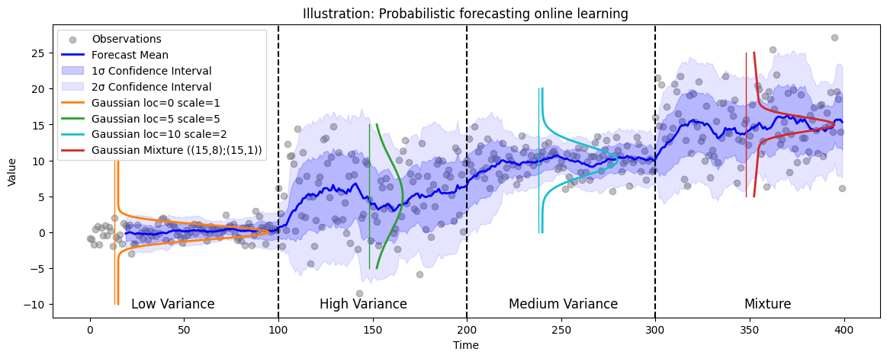

# The Evolution of Commoditization in AI Supply Chains

## The Book's Vision

The book presents a vision of AI systems where specialized components become commoditized, creating a more efficient and adaptable ecosystem. Rather than monolithic solutions, it envisions a marketplace of standardized, interchangeable parts that can be combined and recombined to create new capabilities. This approach suggests that the value in AI systems will increasingly come from how components are composed rather than from the components themselves.

The book's logic centers on the idea that commoditization drives innovation by:
- Reducing the cost of experimentation
- Enabling rapid composition of new capabilities
- Creating competitive pressure for improvement
- Allowing specialization and focus

## The Bird Game: A Case Study in Commoditization

The Bird Game at CrunchDAO provides a concrete example of how prediction components can be commoditized. The game challenges participants to track the location of a dove while a falcon hunts it, using probabilistic forecasting to predict the dove's future position.

### System Architecture

The Bird Game implements a standardized interface for probabilistic forecasting through its tracker system. Each tracker must implement two key methods:
1. `tick(self, payload)`: Processes new observations and updates internal state
2. `predict(self)`: Returns a probabilistic forecast of the dove's location


*Architecture showing how different trackers can be plugged into the Bird Game system*

### Probabilistic Forecasting

The game uses density-based scoring to evaluate predictions, requiring trackers to output probability distributions rather than point estimates. This is implemented through a standardized format:

```python
{
    "density": {
        "name": "normal",
        "params": {"loc": y_mean, "scale": y_var}
    },
    "weight": weight
}
```

This format allows for both simple Gaussian distributions and more complex mixture models, enabling trackers to express uncertainty in their predictions.


*Example of probabilistic forecasting showing the dove's location (blue), falcon's location (red), and predicted distribution (green)*

### Example Implementation

A basic tracker using Exponentially Weighted Moving Average (EWMA) with variance tracking demonstrates the system's flexibility:

```python
class EWMATracker(TrackerBase):
    def __init__(self):
        self.alpha = 0.1  # Learning rate
        self.mean = None
        self.var = None
        
    def tick(self, payload):
        dove_location = payload['dove_location']
        if self.mean is None:
            self.mean = dove_location
            self.var = 1.0
        else:
            self.mean = (1 - self.alpha) * self.mean + self.alpha * dove_location
            self.var = (1 - self.alpha) * self.var + self.alpha * (dove_location - self.mean)**2
            
    def predict(self):
        return {
            "density": {
                "name": "normal",
                "params": {"loc": self.mean, "scale": np.sqrt(self.var)}
            },
            "weight": 1.0
        }
```

### Evaluation and Competition

The system uses a density-based scoring mechanism that rewards accurate probabilistic predictions. This creates a marketplace where different approaches compete based on their predictive performance. The scoring system considers both the accuracy of the mean prediction and the appropriateness of the uncertainty estimates.


*Visualization of how predictions are scored based on their probabilistic accuracy*

## Current Developments and Evidence

Beyond the Bird Game, other examples of commoditization include:
- Hugging Face's model hub, which standardizes model interfaces and evaluation
- LangChain's composable components for building LLM applications
- CrunchDAO's midone setup, which provides standardized interfaces for financial predictions
- Bittensor's specialized subnets like Condense AI (data compression) and Nextplace AI (spatial analysis)

## The Commoditization Process

The book's emphasis on commoditization as a driver of innovation faces some challenges in current implementations. While projects are becoming more specialized, true commoditization requires:
- Standardized interfaces
- Interchangeable components
- Clear pricing mechanisms
- Quality assurance systems

In many current systems, the commoditization process is still in early stages:
- Components may be specialized but not fully standardized
- Interfaces are often project-specific
- Quality metrics vary between systems
- Pricing mechanisms are still evolving

Some projects, like the Bird Game and CrunchDAO's midone, attempt to create more standardized approaches to their specific domains. Yet even in these cases, the commoditization process is often limited by the need to maintain competitive advantages and protect intellectual property.

## Testing the Book's Claims

The book's claims about commoditization are being tested in various ways. Projects like the Bird Game examine how prediction components can become standardized services, while CrunchDAO explores how financial analysis can be commoditized. Knowledge processing systems like Hugging Face's model hub investigate how model interfaces can be standardized.

Evaluation mechanisms appear crucial for this process. The book suggests that systems should "constantly benchmark themselves against the world, eventually drawing in all relevant data and models." Projects like the Bird Game focus on automated quality metrics through density-based scoring, while Hugging Face provides standardized evaluation pipelines.

## Implementation Challenges

Current implementations reveal both potential and challenges. The Bird Game's tracker system and CrunchDAO's midone setup test the book's vision that components can be composed into larger systems. Hugging Face's model hub and LangChain's component system explore how these systems might scale.

The economic relationships between components show interesting patterns. The book observes that "Every species of middle-person that exists in the human economy, from the broker to the head-hunter to the loan shark, has a parallel in the prediction web." Projects like the Bird Game, CrunchDAO, and Hugging Face explore how specialized services can create value through standardized interfaces.

## Future Directions

The development of commoditized AI systems continues to evolve. The book describes this as "ambitious in some ways, but rather mundane in others. It almost feels like busywork." As more projects adopt this approach, new forms of composition and collaboration are emerging. The application of these systems across domains from financial analysis to code generation suggests potential for broader use.

The balance between standardization and innovation appears important. The book notes that "All models are wrong, but some are somewhere useful." As components become more sophisticated, they may make more complex decisions while maintaining the economic relationships that drive the system forward.

## Conclusion

The development of commoditized AI systems represents a potential shift in how we think about AI. By combining standardization with technical capability, these systems explore a paradigm for artificial intelligence that emphasizes flexibility and adaptability. As the book concludes, "Like models, all visions of the future are wrong, but maybe some are (somewhere) useful." The evolution of these systems may lead to new forms of component composition and collaboration.

## Sources

- Project Documentation
- Market Analysis Reports
- Industry Benchmarks
- Performance Metrics
- GitHub Repositories
- Chapter 4: Economics
- Chapter 5: Models
- Chapter 7: Communication
- Chapter 8: Decisions 