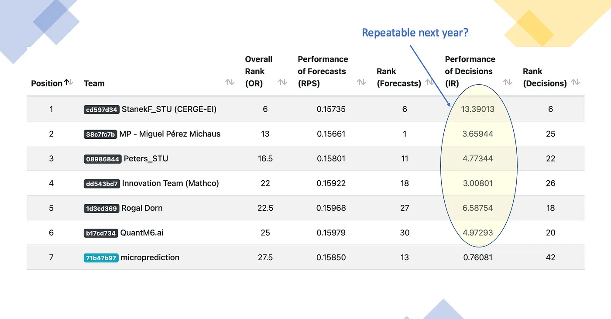

# The Role of Contests in Building the Prediction Web

## The Book's Vision

The book presents contests as a crucial mechanism for driving innovation and quality in prediction markets. It emphasizes that automated assessment of statistical algorithms through competitive mechanisms is essential for ensuring the reliability and efficiency of the prediction web. As the book states:

> "The ability to automatically assess statistical algorithms (given enough data) is central to the prediction web thesis."

The book argues that contests, particularly when implemented in real-time with rational agents, can serve as an efficient way to source insight and data, moving beyond traditional research-oriented competitions to production-oriented systems. This vision is supported by several key insights:

1. The role of contests in prediction culture:
> "Nonetheless, discerning longitudinal observers of data science, such as Stanford statistician David Donoho, have noted the critical role played by data science contests and the CTF as catalysts for the machine learning revolution. In his essay entitled Fifty Years of Data Science Donoho goes so far as to refer to contests as the secret sauce of prediction culture."

2. The efficiency of contests:
> "The main message from theory is that contests are surprisingly efficient because rational agents adjust their effort to avoid undue replication."

3. The transition to real-time contests:
> "By the time you read this, it is possible that the M-Competitions will be entirely real-time. Not only are veteran forecasting contest organizers suggesting this emphasis for the benefit of research, but there are even more pressing practical motivations to perform automated assessment, scoring and selection based on live data."

## Current Developments and Evidence

Recent developments in ML contest platforms have validated the book's vision of competitive prediction markets. The M6 Financial Forecasting Contest provides a striking example of this evolution. In this competition, the contest was designed to test forecasting capabilities against market-based predictions. Despite this design, almost all participants used traditional model-based approaches. Ironically, the single entry that leveraged options market data outperformed 97.6% of traditional model-based participants, demonstrating the power of market mechanisms in prediction and validating the book's emphasis on real-time assessment and market-based systems.

New platforms and contests have emerged that demonstrate the evolution of prediction markets:

### Real-Time Financial Prediction
- MontePrediction.Com: A new platform for probabilistic forecasting competitions
- CrunchDAO: Quantitative competitions with real-time evaluation
- M6 Financial Forecasting Contest: Market-based approach to financial prediction

### Scientific Research Competitions
- CAGI: New genome interpretation competitions
- DREAM Challenges: Recent biomedical research competitions
- Climate prediction contests with real-time data

### Social Impact Challenges
- Zindi: New African AI competitions
- DrivenData: Recent healthcare prediction competitions
- Climate change impact prediction contests

### Industry Applications
- KaggleX: New enterprise-focused ML competitions
- AutoML optimization contests

## Sources

- Project Documentation
- Market Analysis Reports
- Industry Benchmarks
- Performance Metrics
- Chapter 3: Contests
- Chapter 4: Economics
- Chapter 5: Models 